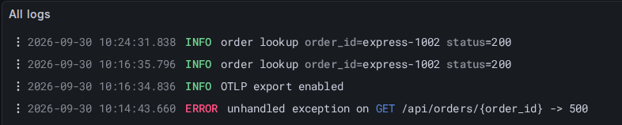
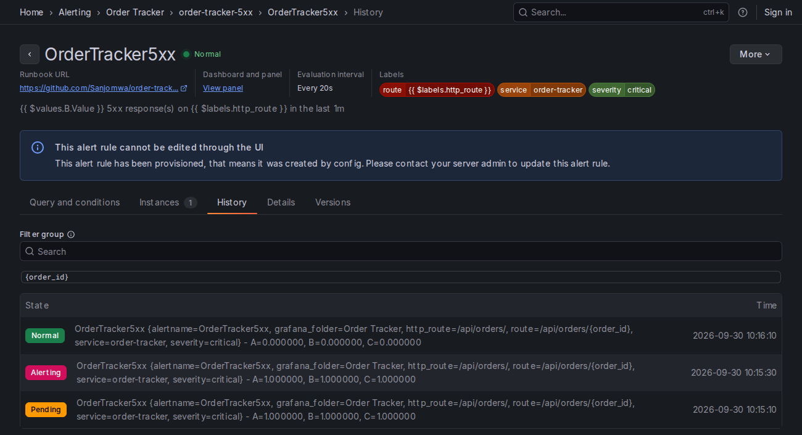
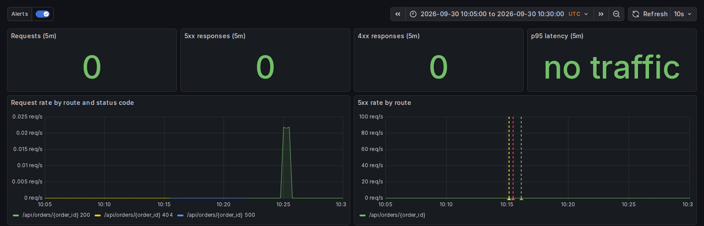
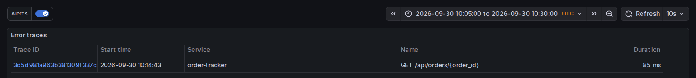
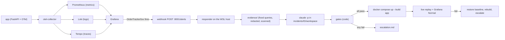

# Order Tracker: observability and a gated incident responder

Order Tracker is a small order-tracking web service with a telemetry pipeline and an incident responder that helps a solo developer find out about server errors and get them fixed within minutes of the first failing request. The main obstacle is trust: the responder uses a coding agent to change production code, so the model only proposes, and code decides whether the change ships.

**Status:** AI Dev Tools Zoomcamp 2026, Module 4 homework, a fork of [alexeygrigorev/order-tracker](https://github.com/alexeygrigorev/order-tracker). For a deeper, human-gated version of the same loop (a read-only responder proposes, a code-enforced policy decides what may run, and a human approves), see [Sanjomwa/agent-relay](https://github.com/Sanjomwa/agent-relay).

## Problem

A customer opens their order and gets an error. The home page loads, the health check passes and the other orders work, so nothing looks wrong unless someone happens to look at the logs. In this app one order failed on one route, and without telemetry that stays invisible.

Handing the fix to a coding agent is fast. It is also dangerous: an agent that can edit code and restart the app can make things worse, touch files it shouldn't, or report success without proof. This repo's responder lets the agent edit a copy of the code, and code-enforced gates decide whether that edit goes live.

## Demo



*"All logs" panel, UTC: the 500 at 10:14:43, the rebuilt app starting at 10:16:34 ("OTLP export enabled"), then 200 for the same order.*



*Alert rule history, UTC: Pending 10:15:10, Alerting 10:15:30, Normal 10:16:10.*



*Dashboard, 10:05 to 10:30 UTC: alert annotations near 10:15; stat tiles cover only 10:25 to 10:30, and rate panels can't draw a lone 5xx on a new series ([why](#decisions-and-trade-offs)).*



*Error traces panel, UTC: the one error trace in the window, `GET /api/orders/{order_id}` at 10:14:43, 85 ms.*

### Timeline of INC-20260930-101540 (UTC)

Sources: [timeline.jsonl](incident-response/incidents/INC-20260930-101540-ordertracker5xx-api-orders-order-id/timeline.jsonl), [gates.json](incident-response/incidents/INC-20260930-101540-ordertracker5xx-api-orders-order-id/gates.json), [mode.json](incident-response/incidents/INC-20260930-101540-ordertracker5xx-api-orders-order-id/mode.json), [summary.md](incident-response/incidents/INC-20260930-101540-ordertracker5xx-api-orders-order-id/summary.md), the Grafana rule history and the logs above.

| Time | Event |
|---|---|
| 10:14:43 | `GET /api/orders/express-1002` returns 500 (one request; ERROR log line and error trace) |
| 10:15:10 | Rule `OrderTracker5xx` goes Pending for route `/api/orders/{order_id}` |
| 10:15:30 | Rule fires (Alerting); alert `startsAt` |
| 10:15:40 | Webhook arrives at the responder (`alert_received`) |
| 10:15:41 | Mode `fix`: all 5 preconditions pass (not a test alert, Grafana API shows the rule Alerting for the route, app/ and tests/ clean, first attempt, lock acquired). Evidence: 11 files, secret scan passed |
| 10:15:41 | Gate 1 `replay_list_from_evidence`: `GET /api/orders/express-1002` taken from the evidence's traces |
| 10:15:46 | Gate 2 `replay_reproduces_before_fix`: 500 against the current code and a copy of the live DB |
| 10:15:46 | Agent starts: `claude -p`, model sonnet, budget $1.00, in the incident workspace |
| 10:16:04 | Gate 3 `repo_untouched_by_agent`: no file outside the workspace changed |
| 10:16:04 | Gate 4 `agent_run`: 17.9 s, $0.0889, 8 turns, 0 permission denials |
| 10:16:04 | Gate 5 `diff_gate`: 1 file (`app/main.py`), 2 changed lines, secret scan clean |
| 10:16:06 | Gate 6 `test_gate`: 8 passed in the patched scratch copy |
| 10:16:07 | Gate 7 `replay_before_restart`: 200 (in-process, patched code) |
| 10:16:07 | Gate 8 `real_tree_unchanged_since_workspace`: pass |
| 10:16:10 | Grafana shows the rule Normal (the 1 m window has emptied; the app is not yet rebuilt) |
| 10:16:34 | Rebuilt app starts |
| 10:16:35 | Gate 9 `restart_app`: `docker compose up --build -d --wait app` exit 0 |
| 10:16:35 | Gate 10 `replay_after_restart`: 200 from the live app |
| 10:16:35 | Gate 11 `grafana_rule_normal`: pass. Outcome **fixed**; final secret scan passed |
| 10:24:31 | A later request for the same order returns 200 |

From the alert firing to `fixed`: 65 seconds. Nothing was committed automatically; the fix was committed after review as `299c08f`.

The agent's patch, [fix.patch](incident-response/incidents/INC-20260930-101540-ordertracker5xx-api-orders-order-id/fix.patch):

```diff
-        estimated_at = placed_at.replace(day=placed_at.day + 2)
+        estimated_at = placed_at + timedelta(days=2)
```

`express-1002` was placed on 31 August, and `replace(day=33)` raises. The regression test [tests/test_order_detail.py](tests/test_order_detail.py) was added afterwards by a human (the agent may not touch `tests/`): 5 of its 8 cases fail on the pre-fix code and all 8 pass on the fix.

## How it works



The model proposes: it reads the evidence and edits a copy of `app/` in a workspace, with no shell, no git and no network. Code decides: the responder picks the mode, builds the replay list from traces rather than from the model's text, checks the diff, runs the tests, replays the failing request before and after, and rolls back if anything after the restart fails. A human reviews and commits: the fix lands as an uncommitted change in `app/`, and fix mode refuses the next incident until `app/` is clean again. Test alerts never reach fix mode.

Full procedure and gate table: [incident-response/RUNBOOK.md](incident-response/RUNBOOK.md).

## Does it work?

**Tests.** `uv run --frozen pytest -q` gives 140 passed:

| Suite | Tests |
|---|---|
| `tests/test_api.py` | 3 |
| `tests/test_order_detail.py` | 8 |
| `tests/test_telemetry.py` | 5 |
| `incident-response/tests/test_evidence.py` | 16 |
| `incident-response/tests/test_fixmode.py` | 38 |
| `incident-response/tests/test_redact_secrets.py` | 27 |
| `incident-response/tests/test_responder.py` | 43 |

The responder tests use a synthetic app, so they don't depend on the real bug.

**The live incident.** The timeline above, with every gate recorded in [gates.json](incident-response/incidents/INC-20260930-101540-ordertracker5xx-api-orders-order-id/gates.json).

**Dry runs.**

| Incident | Input | Mode | Outcome |
|---|---|---|---|
| [INC-20260930-095132-testalert](incident-response/incidents/INC-20260930-095132-testalert/) | Grafana's "Test" button on the contact point (no `route` label) | read-only: `grafana_rule_firing` failed | escalated, app/ unchanged |
| [INC-20260930-093521-respondertest](incident-response/incidents/INC-20260930-093521-respondertest/), [INC-20260930-095229-respondertest](incident-response/incidents/INC-20260930-095229-respondertest/) | homework test alert (`labels.test == "true"`) | read-only | analysed, not escalated |

**Canaries.** [canary-results.md](incident-response/canary/canary-results.md) holds two matrices: which network paths let Grafana reach a listener on the WSL host, and which `claude -p` permission flags keep edits inside the workspace. One finding shaped the design: a bare `Grep` allow rule has no path scope and leaked a dummy token from outside the workspace. The fix-mode flag set (variant vi) denied every read and write outside the workspace and every edit to `tests/` and `evidence/` inside it.

**Monitoring.** Dashboard [order-tracker.json](observability/grafana/dashboards/order-tracker.json) ("Order Tracker Overview"): request, 5xx, 4xx and p95 stats; request rate by route and status; 5xx and 4xx rate by route; p95 latency; requests since app start; recent traces; all logs; warnings and errors; error traces. Alert [order-tracker-5xx.yaml](observability/grafana/provisioning/alerting/order-tracker-5xx.yaml), evaluated every 20 s with a 20 s pending period:

```promql
sum by (http_route) (
  (count - count offset 1m)   # series that existed 1 m ago
  or count                    # series born in the last minute: all of it is new
) or on() vector(0)
```

(`count` stands for `http_server_request_duration_seconds_count{service_name="order-tracker", http_response_status_code=~"5.."}`.) A route's first 5xx creates its series, and `increase()` can't see a series' first sample, so it would miss exactly this incident. `or on() vector(0)` makes the query return a value when no route has errors, so No data is reserved for real failures (see the comments in the YAML).

## Quickstart

Prerequisites: Docker Desktop (or Docker Engine) with Compose, [uv](https://docs.astral.sh/uv/), and, only for the responder, the Claude Code CLI logged in (`claude` on `PATH`).

```bash
git clone https://github.com/Sanjomwa/order-tracker.git
cd order-tracker
cp .env.example .env    # optional: set GRAFANA_ADMIN_PASSWORD before the first start
docker compose up --build -d --wait
curl -s http://127.0.0.1:8000/healthz
```

- App: <http://127.0.0.1:8000>. Three sample orders are created on first start.
- Grafana: <http://localhost:3000/d/order-tracker-overview/order-tracker-overview>. Anonymous visitors get the Viewer role, so no login is needed to see dashboards, logs and alert rules.
- Tests: `uv run --frozen pytest -q`.
- Stop: `docker compose down`. Add `-v` only if you also want to delete the order data and telemetry.

Start the responder (runs on the host, listens on 127.0.0.1:8001):

```bash
incident-response/start-responder.sh start     # also: stop, status
tail -f incident-response/logs/responder.log
```

Send the homework test alert (read-only; starts one `claude -p` run, about $0.06, and writes a folder under `incident-response/incidents/`):

```bash
curl -s -X POST http://127.0.0.1:8001/alerts -H 'Content-Type: application/json' \
  -d '{"alerts":[{"status":"firing","labels":{"alertname":"ResponderTest","test":"true"},"annotations":{"summary":"Test notification; no incident to fix"}}]}'
```

The reply is `202` with the accepted incident ID; the analysis lands in that folder's `answer.md`. The same payload sent again within 10 minutes counts as a duplicate.

**Networking assumption.** This runs on WSL2 with Docker Desktop, where `host.docker.internal` from a container reaches WSL's loopback, so Grafana can call a responder bound to 127.0.0.1 ([canary Part 1](incident-response/canary/canary-results.md#part-1-can-grafana-reach-the-responder)). On a native Linux engine a container can't reach the host's 127.0.0.1: add `extra_hosts: ["host.docker.internal:host-gateway"]` to the grafana service and bind the responder (`HOST` in `responder.py`) to the Docker bridge address (then `start-responder.sh`'s health probe on 127.0.0.1:8001 needs the same change), or run the receiver as a container on the compose network (canary Part 1B).

### API

| Method | Path | Purpose |
| --- | --- | --- |
| GET | `/` | Web page |
| GET | `/healthz` | Database health check |
| GET | `/api/orders` | List orders |
| POST | `/api/orders` | Create an order |
| GET | `/api/orders/{id}` | Check an order |
| PATCH | `/api/orders/{id}` | Change an order status |

The app uses SQLite to keep setup small. Run one app container at a time. Order data lives in the `orders` volume and survives container recreation.

## Configuration

`docker compose up --build -d --wait` works without a `.env`.

| Variable | Read by | Required | Default | Purpose |
|---|---|---|---|---|
| `ORDER_TRACKER_PORT` | compose, responder | optional | `8000` | Host port for the app. The responder's live replay uses it too, so start both with the same value |
| `ORDER_TRACKER_TAG` | compose | optional | `local` | Image tag for the app |
| `ORDER_TRACKER_SUBNET` | compose | optional | `10.215.24.0/24` | Subnet of the compose network |
| `OTEL_CONSOLE_EXPORT` | app | optional | `false` in compose (`true` in the app code) | Also print spans, metrics and logs to `docker compose logs app` |
| `GRAFANA_ADMIN_PASSWORD` | compose (grafana) | optional, recommended | `admin` | Admin password, applied only when the Grafana volume is first created |
| `ORDER_DB_PATH` | app | optional | `data/orders.db` (compose sets `/data/orders.db`) | SQLite file |
| `OTEL_EXPORTER_OTLP_ENDPOINT` | app | optional | unset (compose sets `http://otel-collector:4318`) | OTLP export on when set |
| `ORDER_TRACKER_VERSION` | app | optional | `dev` | `service.version` resource attribute |
| `DEPLOYMENT_ENVIRONMENT` | app | optional | `local` | `deployment.environment.name` resource attribute |
| `RESPONDER_FIX_MODE` | responder | optional | `on` | `off` analyses every real alert read-only and escalates it |
| `RESPONDER_PORT` | responder | optional | `8001` | Listener port. Grafana's contact point and `start-responder.sh` still use 8001 |

`.env` is gitignored; [.env.example](.env.example) shows how to generate a password. The responder passes only an allowlist of environment variables to `claude` (`ENV_ALLOWLIST` in `responder.py`).

## Project structure

```
app/                     FastAPI service; telemetry.py sets up OTel (traces, metrics, logs)
tests/                   app tests, including the express-date regression test
static/index.html        web page
compose.yaml             app + otel-collector + Prometheus + Loki + Tempo + Grafana, 127.0.0.1 only
observability/           collector, Prometheus, Loki, Tempo config; Grafana datasources, dashboard, alert, contact point
incident-response/
  responder.py           webhook receiver, mode selection, claude -p runs, summaries
  evidence.py            fixed Prometheus/Loki/Tempo queries, redaction, secret scan
  fixmode.py             preconditions, workspace, gates, apply, rollback
  responder-task.md      the prompt template (read-only and fix variants)
  RUNBOOK.md             operating the responder, escalations, manual revert
  canary/                network and permission canaries, results
  incidents/             one folder per incident (committed as evidence)
  tests/                 responder tests against a synthetic app
docs/images/             screenshots used in this README
```

## Decisions and trade-offs

1. **Gated agent edits.** I chose an agent that edits code behind code-enforced gates over agent-relay's human approval because the homework loop is alert, fix, restart, verify with no one at the keyboard. The downside is that a change reaches the running app before a human sees it. I accepted it because the change is small by rule (existing `app/**.py` only, at most 60 lines), must reproduce the failure first, must pass the tests and both replays, rolls back on any failure after the restart, and stays uncommitted until a human commits it.
2. **Responder on the WSL host.** I chose to run the responder on the host over a container because it needs the developer's `claude` login and the Docker CLI to rebuild the app. The downside is that it depends on Docker Desktop's `host.docker.internal` forwarding and runs with the developer's permissions. I accepted it because a container would need `~/.claude` mounted and the Docker socket, which is root-equivalent, so it would add little isolation.
3. **Exact 5xx count.** I chose a Grafana-managed alert with an exact per-route 5xx count over `increase()` because `increase()` misses a route's first 5xx, the sample that creates the series. The downside is a harder-to-read query, and the dashboard's rate panels still can't draw a single 5xx. I accepted it because a single failing request is the incident this app has.
4. **Deny rules and a repo fingerprint.** I chose explicit permission rules (edits allowed only inside the workspace, `tests/` and `evidence/` denied) plus a fingerprint of the repo around the run over trusting the prompt because the canary showed an unscoped allow rule leaking data from outside the workspace. The downside is a dependence on Claude Code's permission semantics (tested on 2.1.285) and a walk of the repo on every run. I accepted it because the diff gate re-checks the result independently, so a permission regression is still caught before anything is applied.
5. **Evidence-only replay lists.** I chose to build the replay list only from the evidence (GET server spans with a 5xx on the alert's route in Tempo traces) over requests the model names because text in logs or alerts could otherwise steer what gets replayed. The downside is that an error without a trace can't enter fix mode and is escalated instead. I accepted it because a fix nobody can reproduce proves nothing.
6. **Anonymous read-only Grafana.** I chose anonymous Viewer access over login-only because a fresh clone then shows the dashboard with no `.env`. The downside is that anyone who can reach 127.0.0.1:3000 sees logs and traces, while anonymous viewers can't open Explore (trace links need a login). I accepted it because every port is bound to 127.0.0.1 and the Viewer role can't change anything.
7. **Test alerts stay read-only.** I chose to keep every test alert read-only over letting a synthetic alert exercise fix mode because the webhook is untrusted and a label must never lead to a code change. The downside is that fix mode can't be demonstrated on demand; the only full fix run is a real incident. I accepted it because `test_fixmode.py` covers the gates against a synthetic app, and the live incident covers the rest.

## Limitations

| Limitation | Practical effect |
|---|---|
| The `grafana_rule_normal` gate passes after a single 5xx because the 1 m window empties on its own | In this incident Grafana showed Normal at 10:16:10, before the rebuilt app started at 10:16:34. The live replay (gate 10) is the real proof |
| Docker Desktop-specific networking | On native Linux the webhook can't reach 127.0.0.1:8001 without the changes in [Quickstart](#quickstart) |
| The responder uses the developer's `claude` login | Agent runs are billed to that account and share its rate limits |
| The webhook has no shared secret | Any local process or container can POST alerts. Fix mode still requires Grafana's own API to show the rule firing |
| No CI | Tests run only when someone runs them |
| One machine, 2-day retention (Prometheus, Loki, Tempo) | The incident's metrics, logs and traces expire; the committed incident folder and screenshots are what remain |
| Grafana's admin password defaults to `admin` on a fresh volume without `.env` | Bound to 127.0.0.1 only; set `GRAFANA_ADMIN_PASSWORD` before the first start |
| The agent can't run code or tests | It reasons from evidence and source only; the gates do all the running |
| The incident's test gate ran 8 tests | The regression test for this bug came afterwards, written by a human |
| Alerts dropped by a responder restart are not retried | Grafana won't re-send a firing alert for 12 h; handle it as an escalation |
| Every test alert starts a paid `claude -p` run | About $0.055 to $0.060 each in the dry runs, plus an incident folder |
| SQLite, one app container | No horizontal scaling; the exercise is about incidents, not load |

## Future work

- **A shared-secret header on the Grafana contact point**, since the canary recommended it and the webhook is reachable from every container.
- **CI running `uv run --frozen pytest -q`** (the canaries need Docker and a `claude` login, so they stay manual), so the regression test protects every push.
- **A Grafana-Normal gate that waits for a fresh request on the route**, so the gate proves the fix rather than an empty window.
- **Portable networking** (the receiver as a compose container, the worker on the host), for native Linux engines.
- **Letting the agent propose a regression test in a separate, human-reviewed patch**, since tests are the one thing the fix run can't add.

## Evidence map

| Question | Evidence |
|---|---|
| Q1: health check | `curl -s http://127.0.0.1:8000/healthz` against the running stack ([Quickstart](#quickstart)) |
| Q2: console metric | [app/telemetry.py](app/telemetry.py), [tests/test_telemetry.py](tests/test_telemetry.py); `OTEL_CONSOLE_EXPORT=true docker compose up --build -d --wait app`, one request, then `docker compose logs app` |
| Q3: status code in Grafana | [compose.yaml](compose.yaml), [dashboard](observability/grafana/dashboards/order-tracker.json): "Request rate by route and status code" and "Requests since app start by route and status code" |
| Q4: alert state | [order-tracker-5xx.yaml](observability/grafana/provisioning/alerting/order-tracker-5xx.yaml); `curl -s http://localhost:3000/api/prometheus/grafana/api/v1/rules` |
| Q5: agent's reply to the test alert | [INC-20260930-093521-respondertest/answer.md](incident-response/incidents/INC-20260930-093521-respondertest/answer.md) |
| Q6: the problem behind the express alert | [INC-20260930-101540 folder](incident-response/incidents/INC-20260930-101540-ordertracker5xx-api-orders-order-id/) (answer.md, fix.patch, gates.json), commit `299c08f`, [tests/test_order_detail.py](tests/test_order_detail.py) |

## Credits

Homework for [AI Dev Tools Zoomcamp](https://github.com/DataTalksClub/ai-dev-tools-zoomcamp) 2026 (DataTalks.Club). The starter app, its tests and the Compose setup come from [alexeygrigorev/order-tracker](https://github.com/alexeygrigorev/order-tracker).
